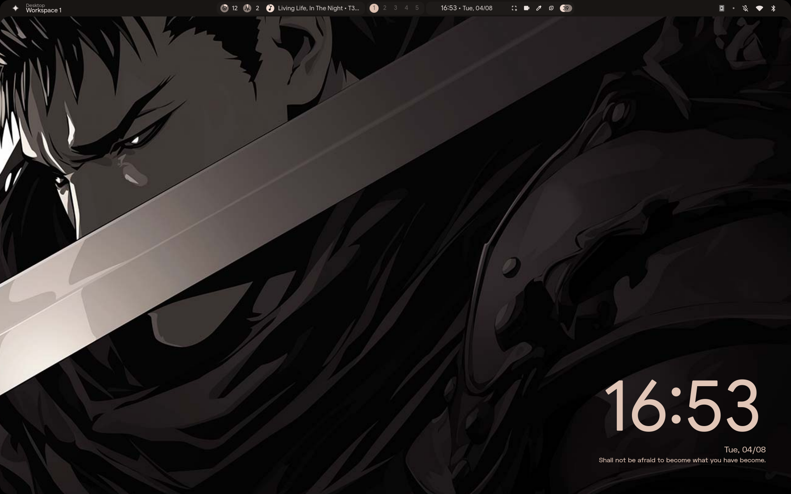

# hyprdots-0 

A stunning lenovo ideapad slim 3 configuration. I love this setup.
This is my configuration for the end4 shell. Previously, I used caelestia, but as it has qml files locked in the root directory, and I want something more configurable, I jumped to end4, whose qml files are in `~/.config/quickshell/ii` and can be edited as is. Though it does not have any official yay based installation, all we need to do is git clone and follow it's instructions - in `setup`.
Installation is as follows.

```bash
git clone --recursive https://github.com/end-4/dots-hyprland && cd dots-hyprland
./setup 
```

- Install Hyprland.
- Install end4.
- Edit config.json.
- Remove bloatware.
- Edit ~/.config/hypr.
- Add functionalities. 
- Save the dots.

## Gallery


